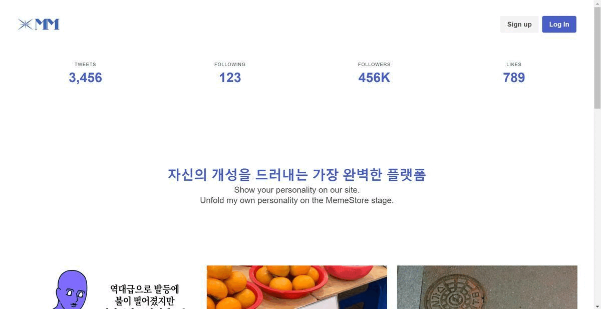
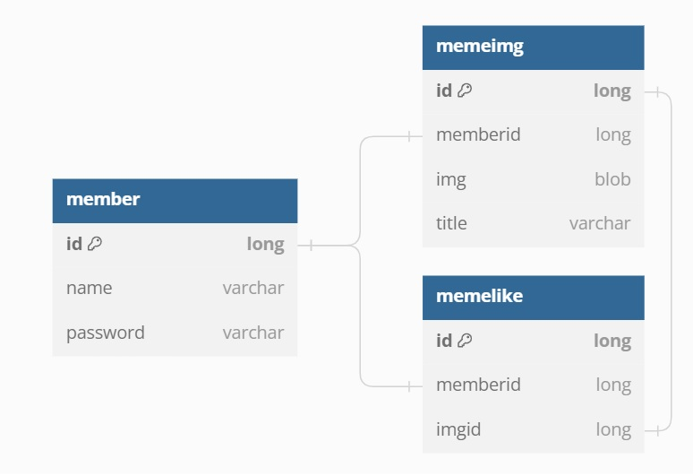

# MemeStore

## 1. 목적
  - 매일 새로운 밈의 등장으로 사람들의 입에 오르며 트렌드를 주도하는 밈!
  - 누구나 쉽게 밈을 제작할 수 있는 기회를 제공하는 Memestore을 제작하자.

## 2. 요구사항
  - H2 DB 설치 필요
    > [H2 Database 다운로드](https://www.h2database.com/html/main.html)
  - Visual Studio Code에서 Spring Boot Extension 설치 필요
    
## 3. 실행방법
  - 3-1 git clone https://github.com/WebPHub/MemeStore
  - 3-2 H2 DB 실행
  - 3-3 HelloSpringApplication.java 실행
  - 3-4 [http://localhost:8080/v/home](http://localhost:8080/v/home) 접속

## 4. 참고자료
  - DB Schema
    
